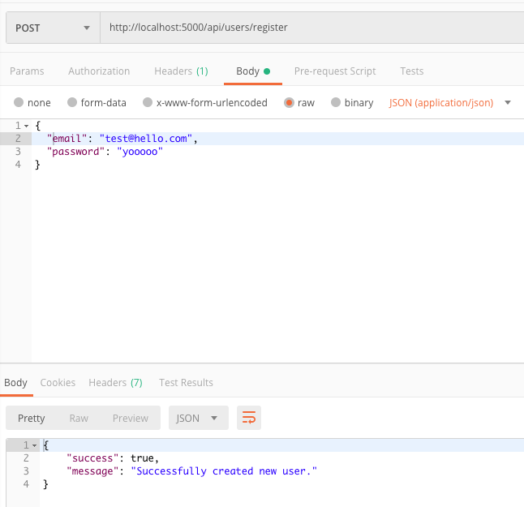
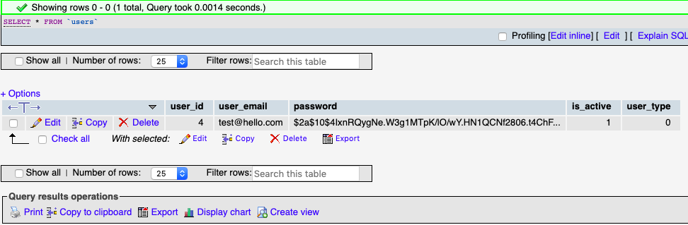
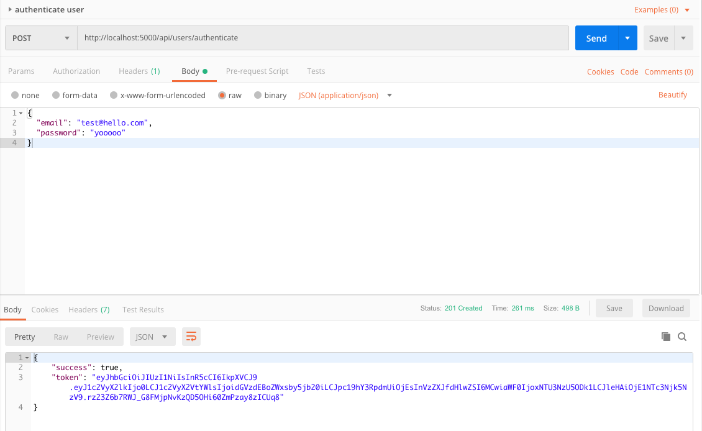

# Passport Auth

Passport Auth is a simple back-end application for secure authentication :lock: with passport and jsonwebtoken.

# Description

## Built with

Developped with [NodeJS](https://nodejs.org/en/NodeJS) / [mySQL](https://www.mysql.com/fr/MySQL) / :heart:

### Dependencies

- [body-parser](https://www.npmjs.com/package/body-parser) - parse incoming request bodies in a middleware, available under the req.body property.
- [bcrypt-nodejs](https://www.npmjs.com/package/bcrypt) - hash passwords
- [cors](https://www.npmjs.com/package/cors) - provides a Connect/Express middleware to enable CORS (Cross-origin resource sharing)
- [express](https://www.npmjs.com/package/express) - provides an HTTP server - and toolings - for Node.js
- [jsonwebtoken](https://www.npmjs.com/package/jsonwebtoken) - provides compact and safe tokens
- [morgan](https://www.npmjs.com/package/morgan) - HTTP request logger
- [passport](https://www.npmjs.com/package/passport) - authentication middleware for Node.js

## Features

### Register

An user can create an account with email and password.  
  
  
_with [postman](https://www.getpostman.com/) a user is created on URL /api/users/register :_  

  


_in PhpMyAdmin we can see that user is created in database with crypted password :_  



### Authenticate

An user can authenticate with email and password.

_with postman a user is authenticated on URL /api/users/authenticate_


If user's password is correct, a JWT token is generated and will allow user to access some routes, like _/api/dashboard_ :key:.

### Routes

3 routes are already available :

- _/api/users/register_
- _/api/users/authenticate_
- _/api/dashboard_

# Getting started

## Prerequisites

If you don't have [Node.Js](https://nodejs.org/en/download/) yet, you need to install it.

If you're not comfortable to handle database from CLI, you can install [PhpMyAdmin](https://www.phpmyadmin.net/).

## Installing

- Clone the repo

```
git clone https://github.com/qdanneville/passport-jwt-mysql
```

- Install dependencies

```
npm install
```

- Import database in PhpMyAdmin from file
  _dbScripts/passport-auth.sql_

- To establish connexion between app and database, change informations in config/main.js file

```module.exports = {
  secret: "Passphrase for encryption",
  database_host: "localhost",
  database_user: "*****",
  database_password: "*****",
  database_name: "passport-auth"
};
```

- Run the app

```
npm run start-dev
```

- Enjoy :sparkles:!

# Authors

- Vamshi Adi - _initial work_ - [GitHub](https://github.com/adivamshi)
- Vanessa Audemar - [GitHub](https://github.com/Vaudem) / [LinkedIn](https://www.linkedin.com/in/vaudem/)
- Elisa Hery - [GitHub](https://github.com/ElisaHery) / [LinkedIn](https://www.linkedin.com/in/elisa-hery/)